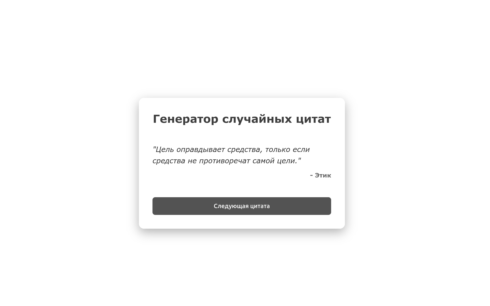

### `README.md`


# Random Quote Generator ExpressJS

Полнофункциональное веб-приложение на Express.js для генерации случайных цитат. Проект включает REST API для управления данными и статический фронтенд с адаптивным дизайном.

## 📋 Особенности

- **RESTful API**: Поддержка операций GET и POST.
- **Модульная архитектура**: Разделение логики на роуты, контроллеры и данные.
- **Middleware**: Кастомное логирование входящих запросов.
- **Frontend**: Адаптивный интерфейс на чистом HTML/CSS/JS.
- **Фильтрация**: Возможность поиска цитат по автору через query-параметры.

## 🛠 Технологический стек

- **Backend**: Node.js, Express.js
- **Frontend**: HTML5, CSS3, Vanilla JS
- **Tools**: Nodemon (для разработки)

## 🚀 Установка и запуск

1. **Клонируйте репозиторий**
 ```  
git clone https://github.com/your-username/random-quote-express.git
cd random-quote-express
   ```

2. **Установите зависимости**
   ```
   npm install
   ```

3. **Запустите сервер**
   
   Режим разработки (с горячей перезагрузкой):
   ```
   npm run dev
   ```
   
   Продакшн режим:
   ```
    npm start
   ```

4. **Откройте приложение**
   Перейдите по адресу [http://localhost:3000](http://localhost:3000)

## 📡 API Endpoints

| Метод | Эндпоинт | Описание |
|-------|----------|----------|
| `GET` | `/api/quotes` | Получить список всех цитат |
| `GET` | `/api/quotes?author=Name` | Найти цитаты по имени автора |
| `GET` | `/api/quotes/random` | Получить одну случайную цитату |
| `GET` | `/api/quotes/:id` | Получить цитату по её ID |
| `POST` | `/api/quotes` | Добавить новую цитату |

### Пример POST запроса
**URL:** `http://localhost:3000/api/quotes`  
**Body (JSON):**
```
{
"text": "Code is like humor. When you have to explain it, it’s bad.",
"author": "Cory House"
}
```

## 📂 Структура проекта

```
random-quote-express/
├── controllers/      # Логика обработки запросов
├── data/             # Мок-данные (массив цитат)
├── middleware/       # Middleware функции (логгер)
├── public/           # Статические файлы (HTML, CSS, JS)
├── routes/           # Маршрутизация API
├── server.js         # Точка входа приложения
└── package.json      # Зависимости и скрипты
```

## 📸 Скриншот




